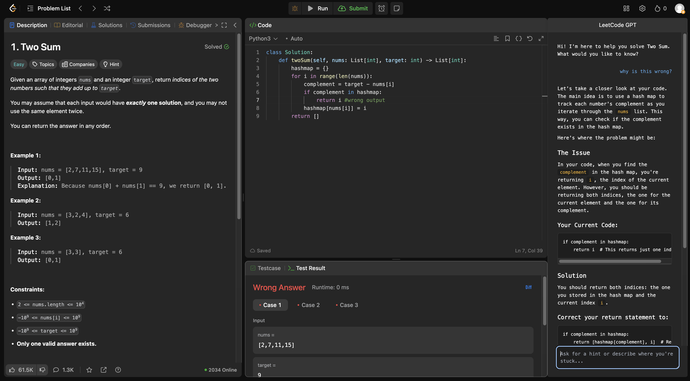

# LeetCode GPT Assistant

A Chrome extension that provides GPT-powered hints and guidance while solving LeetCode problems, helping you learn and improve your problem-solving skills without giving away complete solutions.

## Features

- Integrated GPT assistance directly in LeetCode
- Extracts problem information and your current code automatically
- Provides contextual hints and guidance
- Clean, modern UI that doesn't interfere with LeetCode's interface
- Helps you learn by guiding you to the solution rather than giving it away

## Setup

1. Clone this repository or download the files
2. Configure your GPT API credentials:
   - Open `config.js`
   - Replace `your_api_key_here` with your actual GPT API key
   - The default endpoint is set to OpenAI's API, modify if using a different provider
3. Open Chrome and go to `chrome://extensions/`
4. Enable "Developer mode" in the top right
5. Click "Load unpacked" and select the directory containing the extension files

## Usage

1. Go to any LeetCode problem page
2. Click the extension icon in your Chrome toolbar
3. Type your question or describe where you're stuck
4. Get helpful hints and guidance to help you solve the problem

## Development

The extension consists of the following files:

- `manifest.json`: Extension configuration
- `popup.html`: UI for the extension popup
- `popup.js`: Handles UI interactions
- `content.js`: Extracts problem information and handles GPT integration
- `config.js`: Stores API credentials and configuration

## Security Note

The `config.js` file contains your API key. Make sure to:

- Add it to your `.gitignore` if using version control
- Never share your API key publicly
- Consider using environment variables in a production environment

## Contributing

Feel free to submit issues and enhancement requests!
